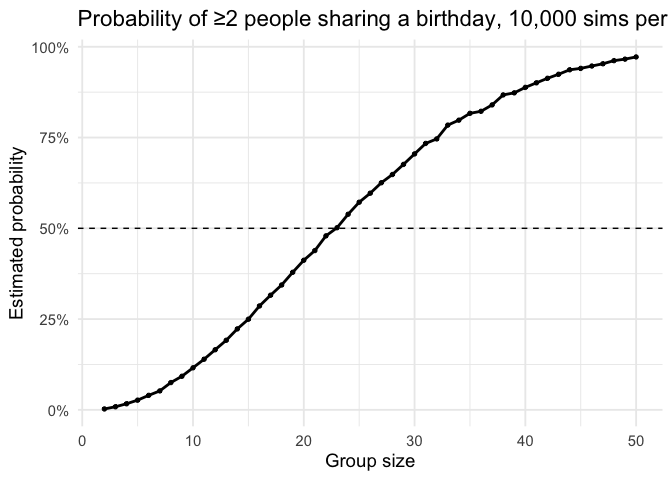

p8105_hw5_yw4664
================
Yijun Wang
2025-11-01

## Problem 1

### Loading Libraries

``` r
library(tidyverse)

library(ggplot2)

set.seed(1) 

source("birthday_functions.R")
```

### Run this function 10000 times for each group size between 2 and 50, compute probability

``` r
n_range <- 2:50
B <- 10000

sim_results <- tibble(n = n_range) |>
  mutate(
    prob_dup = map_dbl(n, ~ mean(replicate(B, bday_collision(.x))))
  )
```

### Make a plot showing the probability as a function of group size

``` r
sim_results |>
  ggplot(aes(x = n, y = prob_dup)) +
  geom_line(size = 1) +
  geom_point(size = 1.2) +
  geom_hline(yintercept = 0.5, linetype = 2) +
  scale_y_continuous(labels = scales::percent_format(accuracy = 1)) +
  labs(
    title = "Probability of ≥2 people sharing a birthday, 10,000 sims per n",
    x = "Group size",
    y = "Estimated probability"
  ) +
  theme_minimal(base_size = 14)
```

    ## Warning: Using `size` aesthetic for lines was deprecated in ggplot2 3.4.0.
    ## ℹ Please use `linewidth` instead.
    ## This warning is displayed once every 8 hours.
    ## Call `lifecycle::last_lifecycle_warnings()` to see where this warning was
    ## generated.

<!-- -->
