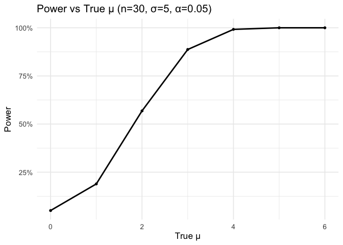
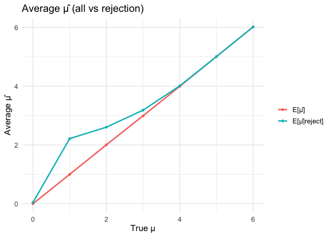
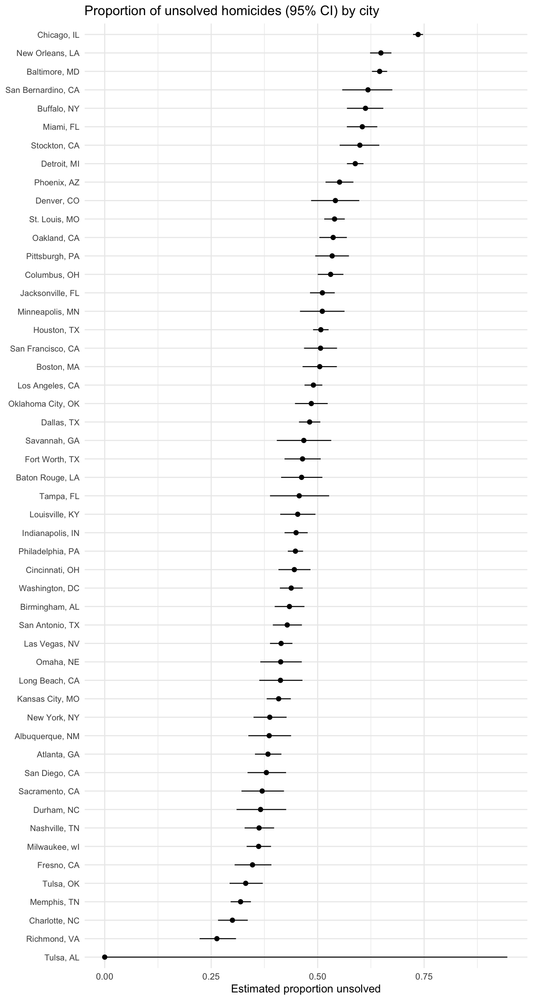

p8105_hw5_yw4664
================
Yijun Wang
2025-11-01

## Problem 1

### Loading Libraries

``` r
library(tidyverse)

library(ggplot2)

set.seed(1) 

source("birthday_functions.R")
```

### Run this function 10000 times for each group size between 2 and 50, compute probability

``` r
n_range <- 2:50
B <- 10000

sim_results <- tibble(n = n_range) |>
  mutate(
    prob_dup = map_dbl(n, ~ mean(replicate(B, bday_collision(.x))))
  )
```

### Make a plot showing the probability as a function of group size

``` r
sim_results |>
  ggplot(aes(x = n, y = prob_dup)) +
  geom_line(size = 1) +
  geom_point(size = 1.2) +
  geom_hline(yintercept = 0.5, linetype = 2) +
  scale_y_continuous(labels = scales::percent_format(accuracy = 1)) +
  labs(
    title = "Probability of ≥2 people sharing a birthday, 10,000 sims",
    x = "Group size",
    y = "Estimated probability"
  ) +
  theme_minimal(base_size = 14)
```

    ## Warning: Using `size` aesthetic for lines was deprecated in ggplot2 3.4.0.
    ## ℹ Please use `linewidth` instead.
    ## This warning is displayed once every 8 hours.
    ## Call `lifecycle::last_lifecycle_warnings()` to see where this warning was
    ## generated.

<!-- -->

The curve starts very close to 0 for small groups, meaning birthday
collisions are very unlikely.

The probability rises sharply between roughly 15 and 30 people, crossing
the 50 % line around n ≈ 23, which is the famous birthday paradox point.

Beyond about 45 people, the probability approaches 1, implying that in
any moderately large group, shared birthdays are almost certain.

## Problem 2

### Loading Libraries

``` r
library(tidyverse)

library(ggplot2)

library(broom)

set.seed(1)

source("power_functions.R")
```

### Simulate 5000 datasets for mu = 0,1,2,3,4,5,6

``` r
mu_grid <- 0:6
B <- 5000

sim_p2 <- map_dfr(mu_grid, ~ bind_rows(replicate(B, power_one_run(.x), simplify = FALSE)))
```

### Plot showing the proportion of times the null was rejected on the y axis and the true value of 𝜇 on the x axis

``` r
sim_p2 %>%
  group_by(mu_true) |>
  summarise(power = mean(reject), .groups = "drop") |>
  ggplot(aes(mu_true, power)) +
  geom_line(size = 1) + geom_point(size = 1.3) +
  scale_y_continuous(labels = scales::percent_format()) +
  labs(title = "Power vs True μ (n=30, σ=5, α=0.05)", x = "True μ", y = "Power") +
  theme_minimal(base_size = 13)
```

<!-- -->

### Plot showing the average estimate of 𝜇̂ on the y axis and the true value of 𝜇 on the x axis and the average estimate of 𝜇̂ only in samples for which the null was rejected on the y axis and the true value of 𝜇 on the x axis.

``` r
sim_p2 |>
  group_by(mu_true) |>
  summarise(
    muhat_overall = mean(mu_hat),
    muhat_condrej = mean(mu_hat[reject]),
    .groups = "drop"
  ) |>
  pivot_longer(-mu_true, names_to = "type", values_to = "avg_muhat") |>
  mutate(type = recode(type,
                       muhat_overall = "E[μ̂]",
                       muhat_condrej = "E[μ̂|reject]")) |>
  ggplot(aes(mu_true, avg_muhat, color = type)) +
  geom_line(size = 1) + geom_point(size = 1.3) +
  labs(title = "Average μ̂ (all vs rejection)",
       x = "True μ", y = "Average μ̂", color = NULL) +
  theme_minimal(base_size = 13)
```

<!-- -->

No, the sample average of μ̂ across tests for which the null was rejected
is not equal to the true μ, when μ is small.

This happens because only samples with unusually large μ̂ are likely to
be significant when the true effect is small.

## Problem 3

### Loading Libraries

``` r
library(tidyverse)

library(ggplot2)

set.seed(1) 

h <- read_csv("data/homicide-data.csv")
```

### Describe the raw data

``` r
dim(h)  
```

    ## [1] 52179    12

``` r
names(h) 
```

    ##  [1] "uid"           "reported_date" "victim_last"   "victim_first" 
    ##  [5] "victim_race"   "victim_age"    "victim_sex"    "city"         
    ##  [9] "state"         "lat"           "lon"           "disposition"

``` r
h |> summarise(
  n_cities  = n_distinct(city),
  n_states  = n_distinct(state),
  years_min = min(lubridate::year(as.Date(reported_date)), na.rm = TRUE),
  years_max = max(lubridate::year(as.Date(reported_date)), na.rm = TRUE)
)
```

    ## # A tibble: 1 × 4
    ##   n_cities n_states years_min years_max
    ##      <int>    <int>     <dbl>     <dbl>
    ## 1       50       28     56920    553688

``` r
h |> slice_head(n = 5)
```

    ## # A tibble: 5 × 12
    ##   uid   reported_date victim_last victim_first victim_race victim_age victim_sex
    ##   <chr>         <dbl> <chr>       <chr>        <chr>       <chr>      <chr>     
    ## 1 Alb-…      20100504 GARCIA      JUAN         Hispanic    78         Male      
    ## 2 Alb-…      20100216 MONTOYA     CAMERON      Hispanic    17         Male      
    ## 3 Alb-…      20100601 SATTERFIELD VIVIANA      White       15         Female    
    ## 4 Alb-…      20100101 MENDIOLA    CARLOS       Hispanic    32         Male      
    ## 5 Alb-…      20100102 MULA        VIVIAN       White       72         Female    
    ## # ℹ 5 more variables: city <chr>, state <chr>, lat <dbl>, lon <dbl>,
    ## #   disposition <chr>

The data includes 52,179 rows and 12 variables.

Variables include uid, reported_date, victim_last, victim_first,
victim_race, victim_age, victim_sex, city, state, lat, lon, and
disposition.

Each row is one homicide case in one of 50 cities across 28 states; it
includes victim demographics, location, and the case disposition.

### Create city_state and summarize totals and unsolved counts by city

``` r
h2 <- h |>
  mutate(
    city_state = str_c(city, ", ", state),
    unsolved = disposition %in% c("Closed without arrest", "Open/No arrest")
  )

by_city <- h2 |>
  group_by(city_state) |>
  summarise(
    n_total    = n(),
    n_unsolved = sum(unsolved, na.rm = TRUE),
    .groups = "drop"
  )

by_city |> slice_head(n = 10)
```

    ## # A tibble: 10 × 3
    ##    city_state      n_total n_unsolved
    ##    <chr>             <int>      <int>
    ##  1 Albuquerque, NM     378        146
    ##  2 Atlanta, GA         973        373
    ##  3 Baltimore, MD      2827       1825
    ##  4 Baton Rouge, LA     424        196
    ##  5 Birmingham, AL      800        347
    ##  6 Boston, MA          614        310
    ##  7 Buffalo, NY         521        319
    ##  8 Charlotte, NC       687        206
    ##  9 Chicago, IL        5535       4073
    ## 10 Cincinnati, OH      694        309

### prop.test function for the city of Baltimore, MD to estimate the proportion of homicides that are unsolved

``` r
balt <- h2 %>% filter(city_state == "Baltimore, MD")

balt_test <- prop.test(
  x = sum(balt$unsolved, na.rm = TRUE),
  n = nrow(balt)
)

balt_tidy <- tidy(balt_test) %>%
  select(estimate, conf.low, conf.high)

balt_tidy
```

    ## # A tibble: 1 × 3
    ##   estimate conf.low conf.high
    ##      <dbl>    <dbl>     <dbl>
    ## 1    0.646    0.628     0.663

### prop.test for every city via a tidy pipeline

``` r
city_prop <- function(df_city) {
  tidy(prop.test(
    x = sum(df_city$unsolved, na.rm = TRUE),
    n = nrow(df_city)
  )) |> select(estimate, conf.low, conf.high)
}

city_est <- h2 |>
  nest(data = -city_state) |>      
  mutate(tidy_res = map(data, city_prop)) |>
  select(-data) |>
  unnest(tidy_res) |>
  arrange(estimate) |>
  mutate(city_state = factor(city_state, levels = city_state))
```

    ## Warning: There was 1 warning in `mutate()`.
    ## ℹ In argument: `tidy_res = map(data, city_prop)`.
    ## Caused by warning in `prop.test()`:
    ## ! Chi-squared approximation may be incorrect

``` r
city_est
```

    ## # A tibble: 51 × 4
    ##    city_state     estimate conf.low conf.high
    ##    <fct>             <dbl>    <dbl>     <dbl>
    ##  1 Tulsa, AL         0        0         0.945
    ##  2 Richmond, VA      0.263    0.223     0.308
    ##  3 Charlotte, NC     0.300    0.266     0.336
    ##  4 Memphis, TN       0.319    0.296     0.343
    ##  5 Tulsa, OK         0.331    0.293     0.371
    ##  6 Fresno, CA        0.347    0.305     0.391
    ##  7 Milwaukee, wI     0.361    0.333     0.391
    ##  8 Nashville, TN     0.362    0.329     0.398
    ##  9 Durham, NC        0.366    0.310     0.426
    ## 10 Sacramento, CA    0.370    0.321     0.421
    ## # ℹ 41 more rows

### Plot estimates and CIs for each city

``` r
ggplot(city_est, aes(x = estimate, y = city_state)) +
  geom_errorbar(aes(xmin = conf.low, xmax = conf.high), width = 0) +
  geom_point(size = 2) +
  labs(
    title = "Proportion of unsolved homicides (95% CI) by city",
    x = "Estimated proportion unsolved", y = NULL
  ) +
  theme_minimal(base_size = 12) +
  theme(axis.text.y = element_text(size = 9))
```


